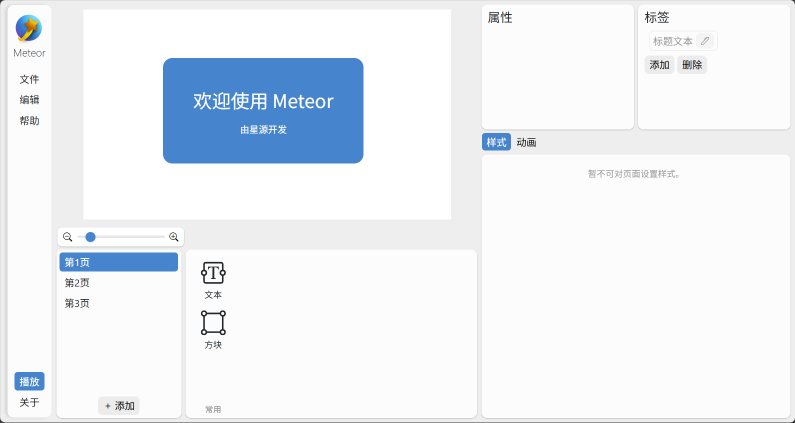
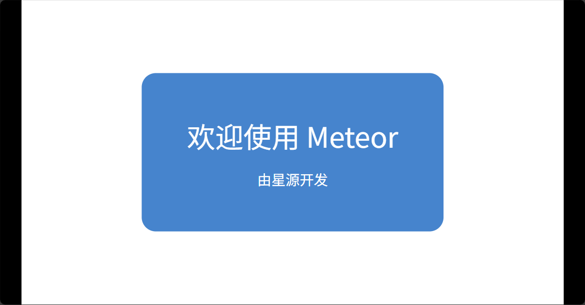

<p align="center">
    
</p>

<p>
<h1 align="center" style="line-height:1;">Meteor</h1>
<p align="center">基于 Html 的演示文稿制作器，跨平台无软件无依赖播放<br>
由星源开发 · Developed by Starry Source</p>
</p>
<p align="center" class="shields">
  <span style="text-decoration:none">
    
  </span>
  <!-- <span href="https://github.com/tjy-gitnub/win12/issues" style="text-decoration:none">
    
  </span>
  <span href="https://github.com/tjy-gitnub/win12/network" style="text-decoration:none">
    
  </span> -->
  <span style="text-decoration:none">
    
  </pan>
</p>

<!-- 
> [!NOTE]
> 功能尚不完善，尚不可用于实际制作使用。 -->

Meteor 是一个演示文稿制作器（即大家说的 "PPT"）。

作为亮点，Meteor 生成的演示文稿可**随时随地**播放。即，在其它电脑上，不必安装 Meteor，演示文稿也能正常播放。

目前，功能上能实现基本的制作，可满足日常使用。

（界面有变更，以实际为准）



## 使用方法

- 在右侧 Releases 中下载最新版本的可执行文件（`.exe` 文件）。
- 运行程序，在浏览器中打开显示的网址，即可使用。

## 运行方法

安装 python，安装依赖，运行命令

```cmd
python manage.py runserver
```
即可。

## 开发环境

Windows 11 24h2\
Python 3.9.13\
Django 4.2.20\
Microsoft Edge
