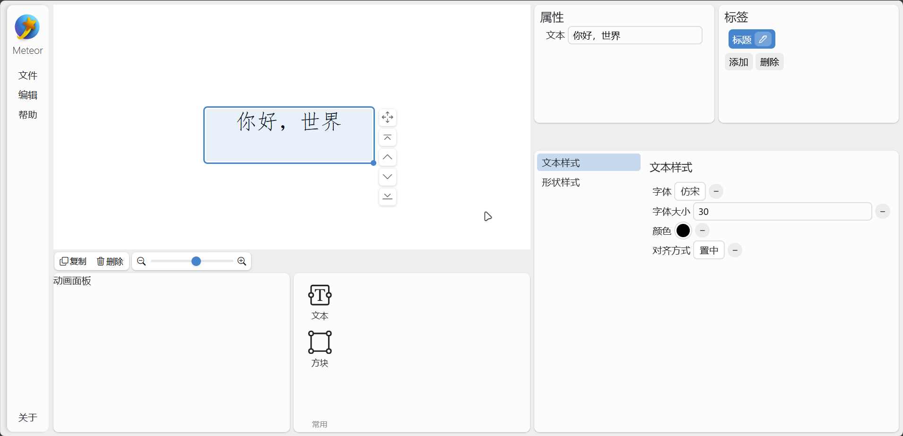

<p align="center">
    
</p>

<p>
<h1 align="center" style="line-height:1;">Meteor</h1>
<p align="center">基于 Html 的演示文稿制作器，跨平台无软件无依赖播放<br>
Developed by Starry Source</p>
</p>
<p align="center" class="shields">
  <span style="text-decoration:none">
    
  </span>
  <!-- <span href="https://github.com/tjy-gitnub/win12/issues" style="text-decoration:none">
    
  </span>
  <span href="https://github.com/tjy-gitnub/win12/network" style="text-decoration:none">
    
  </span> -->
  <span style="text-decoration:none">
    
  </pan>
</p>

<br>
这不是测试版，更不是正式版，也不是发行版。

目前功能上能制作单页演示文稿，但尚不支持播放和导出；元素上只支持文本。



## 环境
### 开发环境

Windows 11 24h2\
Python 3.9.13\
Django 4.6.1\
Microsoft Edge


## 运行
安装 python，安装 django，运行命令

```cmd
python manage.py runserver
```
即可。